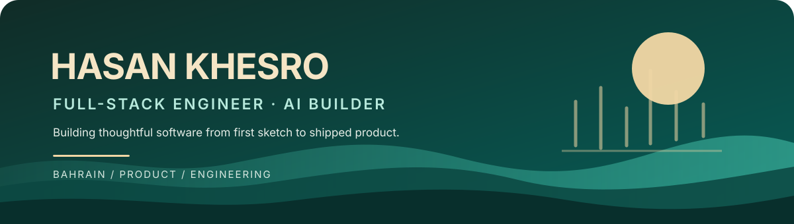

**Bahrain 🇧🇭 · Full-stack engineering · Practical AI · Product thinking**

I turn ideas into thoughtful web experiences—from full-stack products to useful AI-assisted demos.

## ✦ What I work with

**ENGINEERING**

**AI & MACHINE LEARNING**

**CLOUD, DELIVERY & PRODUCT**

## ✦ Selected work

| | |
|:---|:---|
| **My Portfolio** | Personal portfolio and product site, built with Next.js, TypeScript, Tailwind CSS, and Framer Motion. [Live site ↗](https://my-portfolio-six-wheat-43.vercel.app) |
| **Re-Wear Bahrain** | Gamified peer-to-peer clothing swaps for Bahrain, with an Eco-Credit system. [Frontend](https://github.com/Hsn13/Re-Wear-Bahrain_Frontend) · [Backend](https://github.com/Hsn13/Re-Wear-Bahrain_Backend) |
| **Roamwise** | A responsive travel-planning demo that turns trip preferences into a day-by-day itinerary. |
| **VERDÉ** | An editorial storefront demo with a local shopping assistant, interactive cart, and wishlist. |
| **Sudoku** | A Go project exploring puzzle solving and algorithms. |

## ✦ GitHub, at a glance

*Live cards use GitHub data: commit totals are all-time (not just the past year); language shares are calculated from code in public repositories, not from commit history.*

### Let's build something thoughtful.

